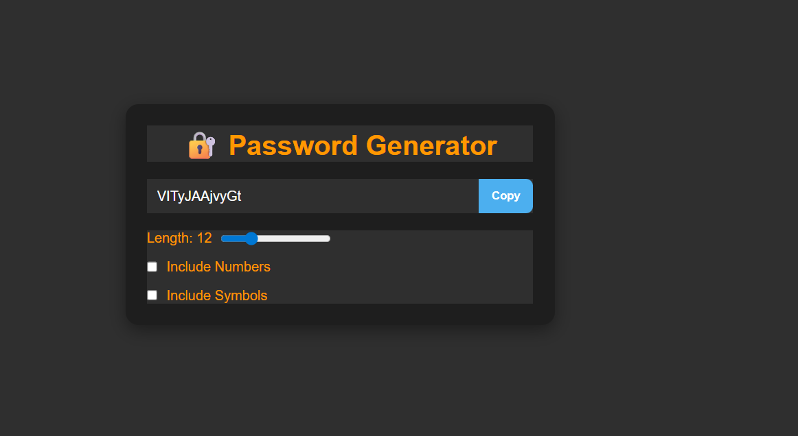
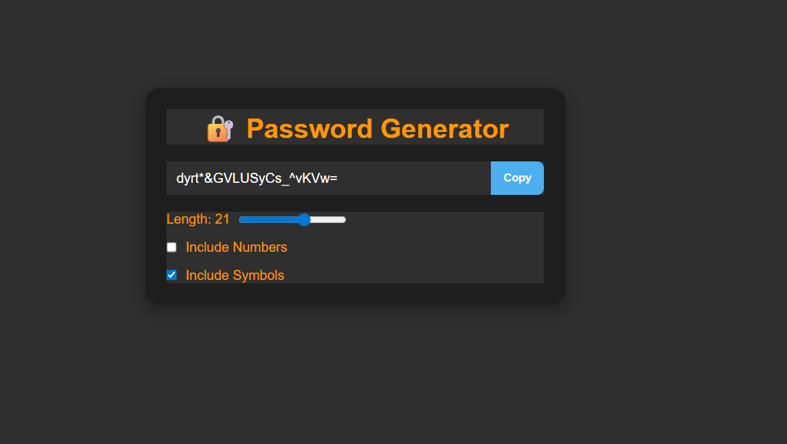
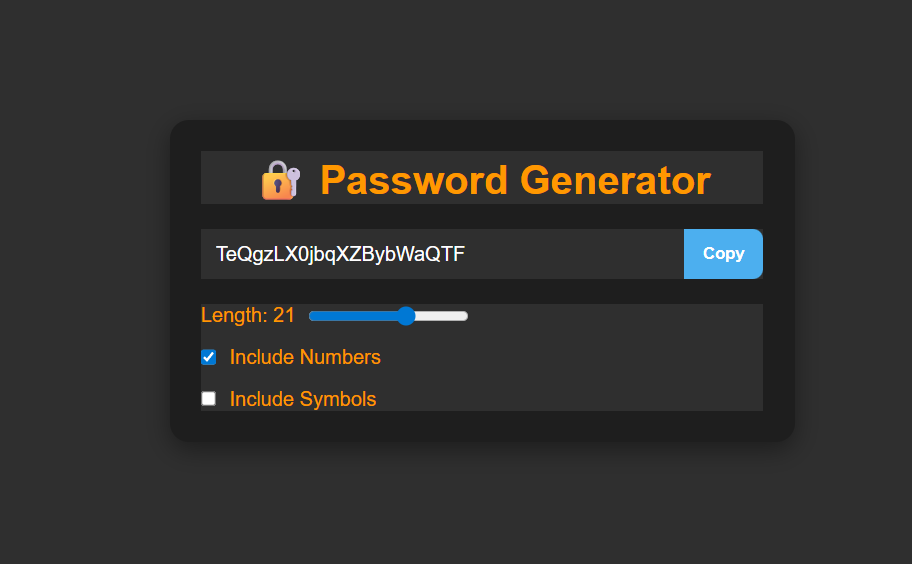

# 🔐 React Password Generator

A simple and modern **React Password Generator**.  
It lets you generate secure passwords with customizable options such as **length, numbers, and symbols**. Includes a one-click copy feature and a clean UI.  

---

## Features
- Generate random and secure passwords
- Adjust password length (6–30 characters)
- Include/exclude numbers
- Include/exclude special symbols
- One-click copy to clipboard
- Responsive and minimal design
- Built with **React Hooks** (`useState`, `useEffect`, `useCallback`, `useRef`)

---

## Demo Screenshots

Here are some previews of the password generator in action:

<p align="center">
  
</p>

<p align="center">
  
</p>

<p align="center">
  
</p>

---

## Installation & Setup

1. Clone the repository:
   ```bash
   git clone https://github.com/your-username/react-password-generator.git
   ```

2. Navigate into the project folder:
   ```bash
   cd react-password-generator
   ```

3. Install dependencies:
   ```bash
   npm install
   ```

4. Start the development server:
   ```bash
   npm run dev
   ```

5. Open in browser:
   ```bash
   http://localhost:5173
   ```

## 📂 Project Structure
```bash
  react-password-generator/
  │── src/
  │   ├── App.jsx
  │   ├── App.css
  │   ├── main.jsx
  │── public/
  │── package.json
  │── README.md
```

## 🛠️ Built With
     React Vite
